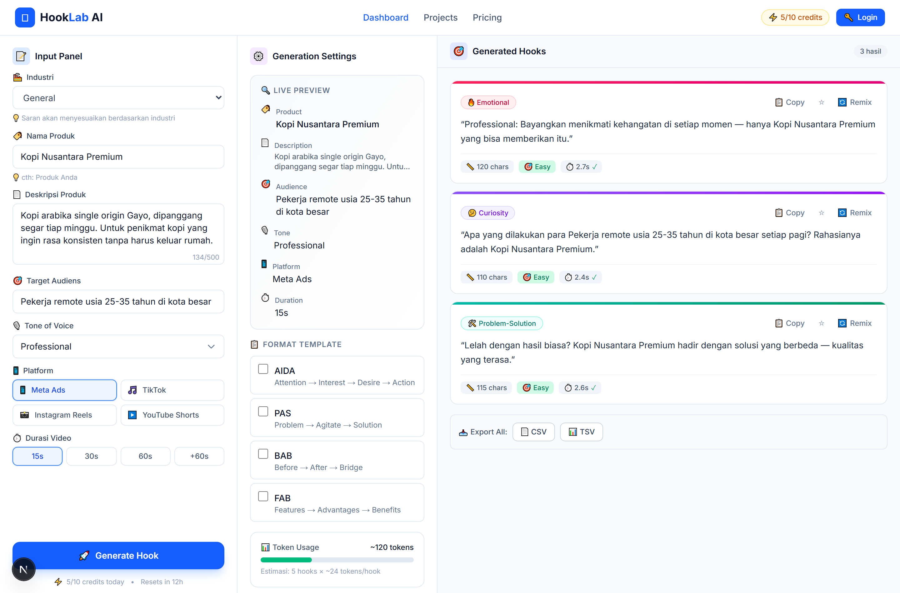
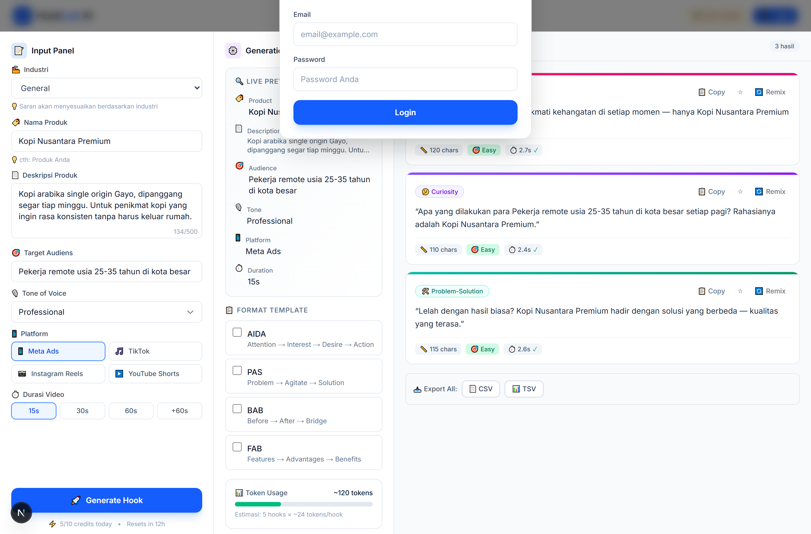
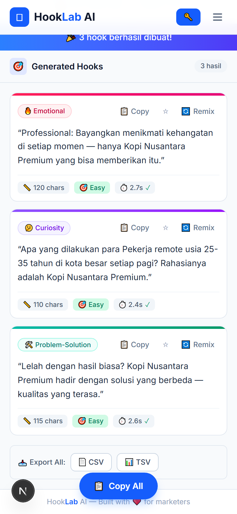

# 🪝 HookLab AI

> Generate scroll-stopping ad hooks for Meta Ads, TikTok, Instagram Reels, and YouTube Shorts — in seconds.

HookLab AI is a full-stack web app that turns a short product brief into a set of ready-to-use
ad hooks built on proven copywriting frameworks. It ships with a three-panel creative workspace,
credentials-based authentication, and a dashboard for tracking generation activity.


---

## 📸 Screenshots

**Generator workspace** — the three panels: brief input, live preview, and the generated hooks.



**Authentication** — credentials sign-in and sign-up share a single modal.



**Mobile flow** — below `md` the panels become a linear flow with a persistent *Copy All* action.



All three are captured from the running app — regenerate them at any time with `npm run screenshots`.

---

## ✨ Features

**Generator workspace**
- Three-panel desktop layout (input → live preview → output gallery) that collapses into a
  linear, mobile-first flow on small screens.
- 8 hook frameworks: Emotional, Curiosity, Statistical, Problem-Solution, AIDA, PAS,
  Before-After-Bridge, and FAB.
- Targeting controls for tone of voice, platform, and video duration, plus a custom tone field.
- Live preview of how the hook lands inside a video feed, with skeleton loading states.
- Per-hook actions: copy, bookmark, and remix — plus "Copy All" and **CSV / TSV export**.

**Authentication**
- Credentials sign-up / sign-in with bcrypt-hashed passwords.
- JWT sessions via NextAuth v5, with a session-aware navbar and user menu.
- Server-side route protection for everything under `/dashboard`.

**Dashboard**
- Overview with stat cards, recent generations, and project activity.

**AI layer**
- Provider-agnostic: route the generation call to an external endpoint, Google Gemini
  (OpenAI-compatible API), or OpenAI.
- Falls back to a built-in mock generator when no API key is configured, so the app is
  fully explorable without any paid service.

---

## 🧱 Tech Stack

| Layer | Choice |
| --- | --- |
| Framework | Next.js 16 (App Router, Turbopack) |
| UI | React 19, Tailwind CSS v4 |
| Language | TypeScript 5 (strict) |
| Auth | NextAuth v5 (Credentials + JWT) |
| ORM | Prisma 7 with the `@prisma/adapter-pg` driver adapter |
| Database | PostgreSQL |
| Security | bcryptjs password hashing |

---

## 🚀 Getting Started

### Prerequisites

- **Node.js** 20.19+, 22.12+, or 24+ (required by Prisma 7)
- **PostgreSQL** 9.6 or newer, running and reachable

### Installation

```bash
git clone <your-repo-url>
cd hooklab-ai
npm install
```

### Configure environment variables

```bash
cp .env.example .env      # Windows PowerShell: Copy-Item .env.example .env
```

Then fill in `.env`:

| Variable | Required | Description |
| --- | --- | --- |
| `DATABASE_URL` | ✅ | PostgreSQL connection string |
| `AUTH_SECRET` | ✅ | JWT signing secret — generate with `npx auth secret` or `openssl rand -base64 32` |
| `AI_ENDPOINT` | — | Custom generation endpoint (highest priority) |
| `GEMINI_API_KEY` | — | Google Gemini via its OpenAI-compatible endpoint |
| `OPENAI_API_KEY` | — | OpenAI chat completions |

### Set up the database

```bash
npx prisma migrate deploy   # apply the migrations in prisma/migrations
npx prisma generate         # generate the type-safe client
```

> Working on the schema? Use `npx prisma migrate dev --name <change>` instead,
> then `npx prisma studio` to inspect the data.

### Run the app

```bash
npm run dev
```

Open [http://localhost:3000](http://localhost:3000).

---

## ⚙️ AI Provider Configuration

`/api/generate` resolves a provider in this order and silently falls back to the mock
generator if the call fails, so a broken key never breaks the UI:

1. `AI_ENDPOINT` — a custom POST endpoint that accepts the form payload and returns
   `{ hooks: [...] }` or a bare array.
2. `GEMINI_API_KEY` — `gemini-2.5-flash` through Google's OpenAI-compatible API.
3. `OPENAI_API_KEY` — `gpt-4o-mini`.
4. *No provider configured* → deterministic mock hooks in Indonesian.

Every provider is prompted to return strict JSON, which is parsed defensively
(markdown fences and extra prose are stripped before `JSON.parse`).

---

## 🔐 How Authentication Works

1. `registerUser()` (`src/lib/auth-actions.ts`) is a Server Action that validates input,
   rejects duplicate emails, hashes the password with bcrypt, and creates the user.
2. Sign-in goes through the NextAuth **Credentials** provider in `src/auth.ts`:

   ```
   form → authorize() → prisma.user.findUnique → bcrypt.compare
        → isActive check → JWT issued (id, uuid, role)
   ```

3. The `jwt` / `session` callbacks enrich the session with the user's id, uuid, and role
   (typed via `src/types/next-auth.d.ts`).
4. `src/proxy.ts` intercepts `/dashboard/*` and redirects unauthenticated visitors to `/`.

---

## 📁 Project Structure

```
src/
├── app/
│   ├── page.tsx                  # Generator workspace (client)
│   ├── dashboard/                # Protected dashboard (layout + overview)
│   └── api/
│       ├── auth/[...nextauth]/   # NextAuth route handler
│       └── generate/             # Hook generation endpoint (multi-provider)
├── components/                   # Navbar, panels, gallery, auth modal, dashboard widgets
├── lib/
│   ├── prisma.ts                 # Prisma client with the pg driver adapter
│   └── auth-actions.ts           # registerUser Server Action
├── types/                        # Shared domain types + NextAuth augmentation
├── auth.ts                       # NextAuth configuration
└── proxy.ts                      # Route protection
prisma/
├── schema.prisma                 # 9 models: users, projects, generations, hook_outputs, …
└── migrations/                   # Initial migration
```

---

## 🧪 Scripts

| Command | Description |
| --- | --- |
| `npm run dev` | Start the dev server (Turbopack) |
| `npm run build` | Production build |
| `npm run start` | Serve the production build |
| `npm run lint` | ESLint |
| `npm run screenshots` | Regenerate the README screenshots (starts a dev server if needed) |
| `npx prisma migrate dev` | Create + apply a migration |
| `npx prisma migrate deploy` | Apply migrations (CI / production) |
| `npx prisma studio` | Browse the database |

`START_APP.bat` is included as a one-click dev-server launcher for Windows.

---

## 🗺️ Roadmap

- [ ] Persist generations and hook outputs to the database (the `Generation`,
      `HookOutput`, and `UsageLog` models are already modelled)
- [ ] Dashboard sub-pages: projects, generations, favorites, settings
- [ ] Favourite/remix actions backed by the API instead of local state
- [ ] OAuth providers alongside credentials
- [ ] Usage-based credit tracking

---

## 📄 License

Not licensed yet — add a `LICENSE` file if you intend others to reuse this code.
